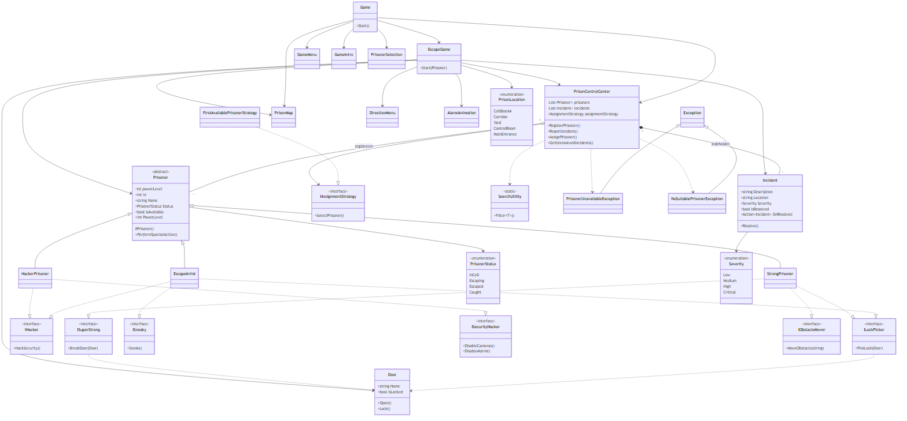
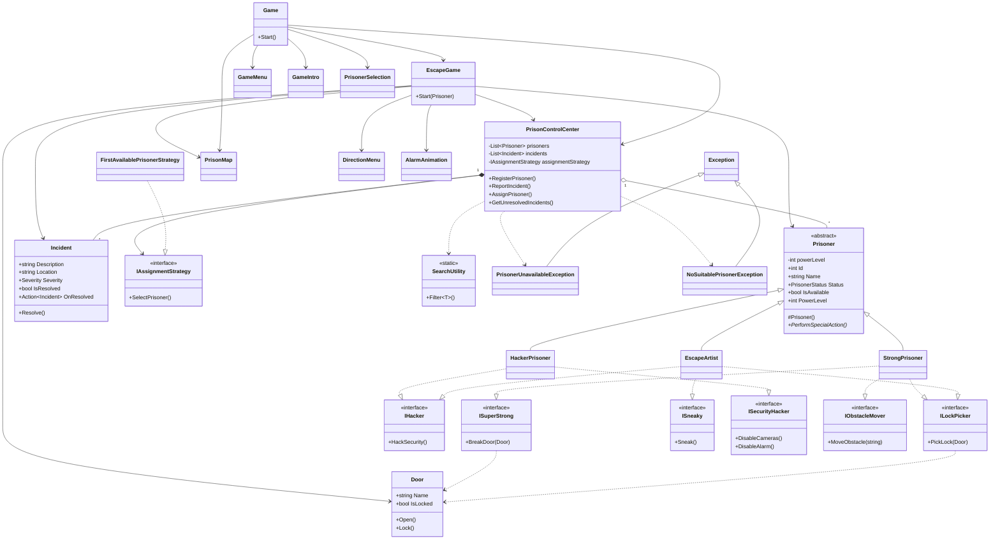

# Fængselsflugts-simulator

C# konsolspil, hvor spilleren vælger en fangetype og forsøger at flygte fra fængslet. Undervejs skal døre, vagter, alarmer og forhindringer håndteres med fangens evner.

Projektet demonstrerer objektorienteret programmering i C#: arv, polymorfi, interfaces, collections, generics, exceptions, callbacks og Dependency Inversion.

## Sådan bygger og starter du

Krav: [.NET 10 SDK](https://dotnet.microsoft.com/download)

**Visual Studio**

1. Åbn `Fængselsflugts-simulator.slnx`
2. Tryk **F5** eller den grønne Start-knap

**Terminal**

```powershell
cd Fængselsflugts-simulator
dotnet build
dotnet run
```

Spillet kører i konsollen, ikke i en browser.

## Sådan styres spillet

| Tast | Handling |
|---|---|
| ↑ / ↓ | Flyt markøren i menuer |
| Enter | Bekræft valg |
| Esc | Gå tilbage fra kort, evner og hændelser |

Forløb:

1. Intro
2. Vælg fange (Escape Artist, Hacker eller Strong Prisoner)
3. Hovedmenu: start flugt, se kort, se evner, se hændelser eller afslut
4. Flugten starter i Celleblok A. Målet er Hovedindgangen.

## Fangetyper

Alle tre arver fra den abstrakte klasse `Prisoner` og overrider `PerformSpecialAction()`. Evner, som ikke alle har, ligger i interfaces.

| Fange | Interfaces | Styrke i spillet |
|---|---|---|
| Escape Artist | `ILockPicker`, `IHacker`, `ISneaky` | Dirk låse og snig forbi vagter |
| Hacker | `IHacker`, `ISecurityHacker` | Hack porte, slå kameraer og alarm fra |
| Strong Prisoner | `ISuperStrong`, `ILockPicker`, `IObstacleMover` | Bryd døre og flyt tunge kasser |

## Fængslet

Kortet i konsollen viser blandt andet Celleblok A/B, Kantine, Gang, Bad, Gård, Sygestue, Vagtrum, Kontrolrum, Lager og Hovedindgang.

Typiske forhindringer:

- Låst celledør og hovedport
- Vagt i gården
- Vagter og kameraer i vagtrummet
- Alarmpanel i kontrolrummet
- Tunge kasser på lageret

Flugten slutter med **DU ER FLYGTET!** eller **DU ER FANGET!**

## Faglige koncepter

- **Arv og abstraktion:** `Prisoner` er abstrakt. `EscapeArtist`, `HackerPrisoner` og `StrongPrisoner` arver fra den.
- **Polymorfi og override:** `PerformSpecialAction()` implementeres forskelligt. Døre og forhindringer vælges via interfaces (`is ILockPicker`, `is ISneaky` osv.).
- **Indkapsling:** `powerLevel` er `private`. `PowerLevel` kan kun sættes via `protected set` og afviser værdier uden for 0–100.
- **Interfaces:** Evner som låsedirkning, hacking og styrke kan blandes uafhængigt af klassehierarkiet.
- **Collections:** `PrisonControlCenter` gemmer `List<Prisoner>` og `List<Incident>`.
- **Generics og lambda:** `SearchUtility.Filter<T>(items, Func<T, bool>)` bruges til både fanger og hændelser.
- **Exceptions:** `PrisonerUnavailableException` og `NoSuitablePrisonerException` kastes og fanges under flugten, så programmet ikke crasher.
- **Callbacks:** `Incident.OnResolved` er `Action<Incident>`. Der tilknyttes både en named method og en lambda, når en hændelse løses.
- **Dependency Inversion:** Se afsnittet nedenfor.

## Access modifiers

| Modifier | Hvor vi bruger den | Hvorfor |
|---|---|---|
| `private` | `powerLevel`, collections i kontrolcentralen | Data skal ikke ændres frit udefra |
| `protected` | `PowerLevel`-setter og `Prisoner`-constructor | Kun basisklassen og underklasser må sætte power og oprette fanger |
| `public` | Metoder og properties, spillet skal kunne kalde | Den synlige API for evner, hændelser og gameplay |
| `internal` | Klasser, interfaces og enums | De skal kun bruges inde i dette projekt, ikke af andre assemblies |

## Dependency Inversion

`PrisonControlCenter` afhænger af `IAssignmentStrategy` frem for en konkret strategi. Derfor kan `FirstAvailablePrisonerStrategy` senere udskiftes med en anden strategi uden at ændre selve `PrisonControlCenter`.

Strategien gives udefra med constructor injection i `Game`:

```csharp
PrisonControlCenter controlCenter = new PrisonControlCenter(
    new FirstAvailablePrisonerStrategy());
```

## UML-diagram

Diagrammet matcher den færdige kode: fangetyper, evne-interfaces, kontrolcentral, gameplay og UI.



Kilde til diagrammet findes i `PrisonEscape-UML.mmd`.



## Teknologier

- C# / .NET 10
- Visual Studio
- Git og GitHub
- Mermaid UML
